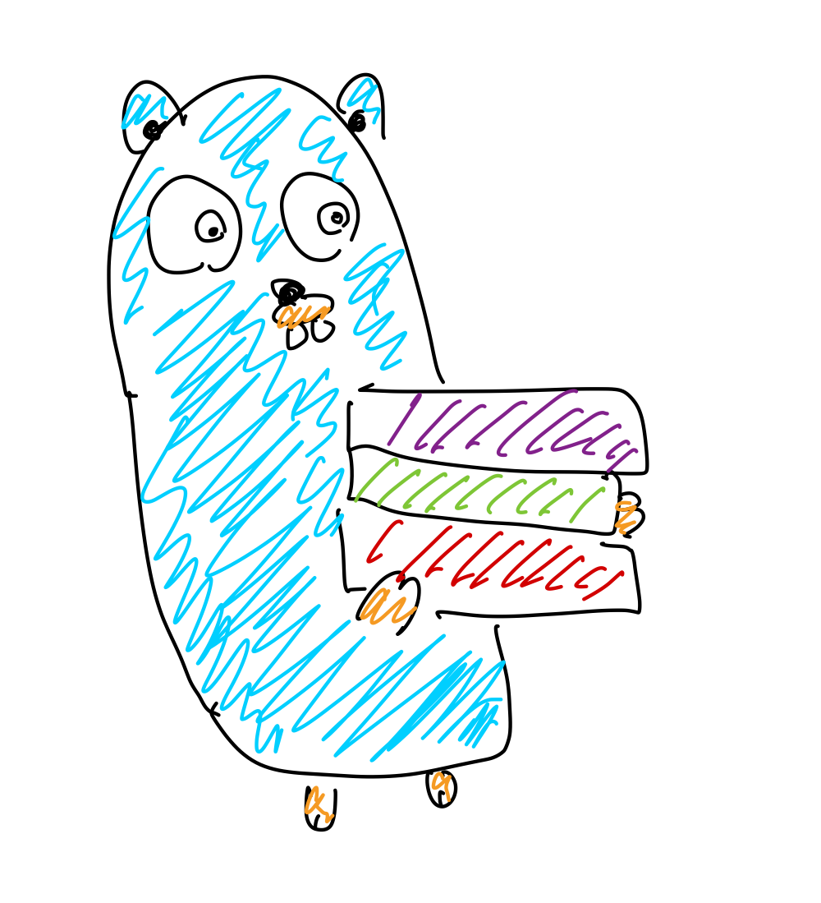

<br />
<p align="center">
  <a
    href="https://github.com/okayama-daiki/kindle-daily-deals-notifier"
    target="_blank"
  >
    
  </a>
</p>

<h3 align="center">kindle-daily-deals-notifier</h3>

<p align="center">
A linebot for never missing daily deals on Kindle books.
</p>

<div align="center">
  
  
  
</div>

## Overview

This project uses AWS Lambda and Amazon EventBridge to create a serverless application that sends daily notifications of Kindle book deals to a LINE Messaging API channel.
Every day at a specified time, the Lambda function fetches the latest Kindle deals and sends them as messages to the configured LINE channel.

## Prerequisites

### LINE Developers Account

1. Create a LINE Developers account at [LINE Developers](https://developers.line.biz/).
2. Create a new provider.
3. Create a new Messaging API channel under the provider.

### LINE Channel Access Token and Target ID

1. Add your LINE account as a friend of the Messaging API channel.
2. Obtain `LINE_CHANNEL_ACCESS_TOKEN` from the [Messaging API channel settings](https://developers.line.biz/console/channel/{channel_id}/messaging-api) page.
3. Obtain `LINE_TARGET_ID` to send notifications.
    - To send a message to yourself, go to the [Basic Settings](https://developers.line.biz/console/channel/{channel_id}/basics) page while logged in (or linked) with your LINE account. You can see the message under "Your user ID."
    - Alternatively, you need to configure the server to respond to the target ID by sending a message to your bot from your LINE app. (Note: If you want to send messages to a group chat, you must invite the bot to the chat.)

### AWS Account & AWS CLI

### Terraform CLI

## Setup

1. Clone the repository
    ```bash
    git clone git@github.com:okayama-daiki/kindle-daily-deals-notifier.git
    ```
2. Navigate to the terraform directory
    ```bash
    cd kindle-daily-deals-notifier/terraform
    ```
3. Copy terraform.tfvars.example to terraform.tfvars and fill in the required values
    ```bash
    cp terraform.tfvars.example terraform.tfvars
    ```
4. Update the `LINE_CHANNEL_ACCESS_TOKEN` and `LINE_USER_ID` in terraform.tfvars with your LINE Messaging API channel access token and user ID.
5. Initialize Terraform and apply the configuration
    ```bash
    terraform init && terraform apply
    ```
